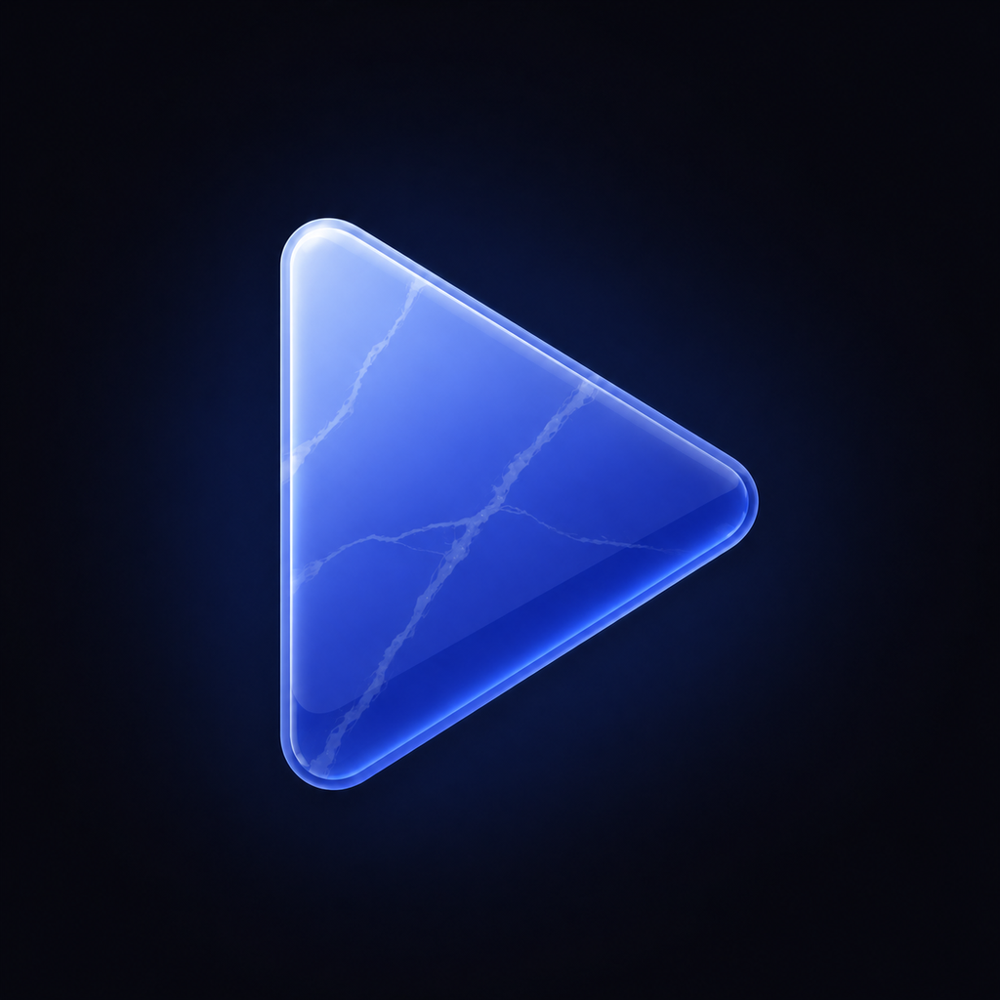
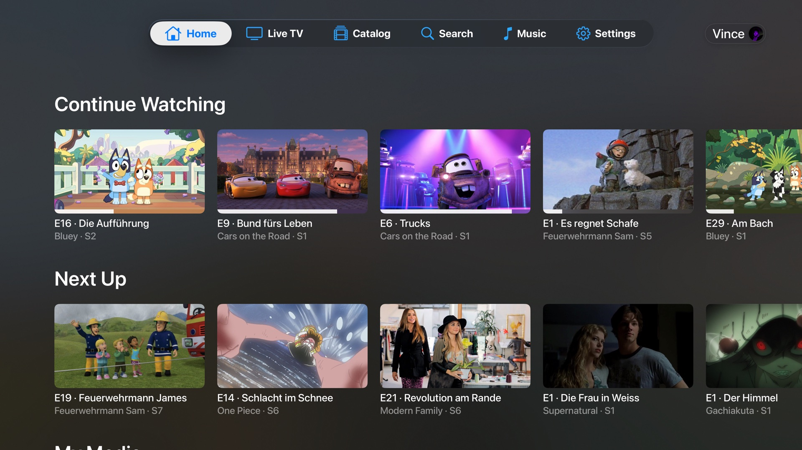
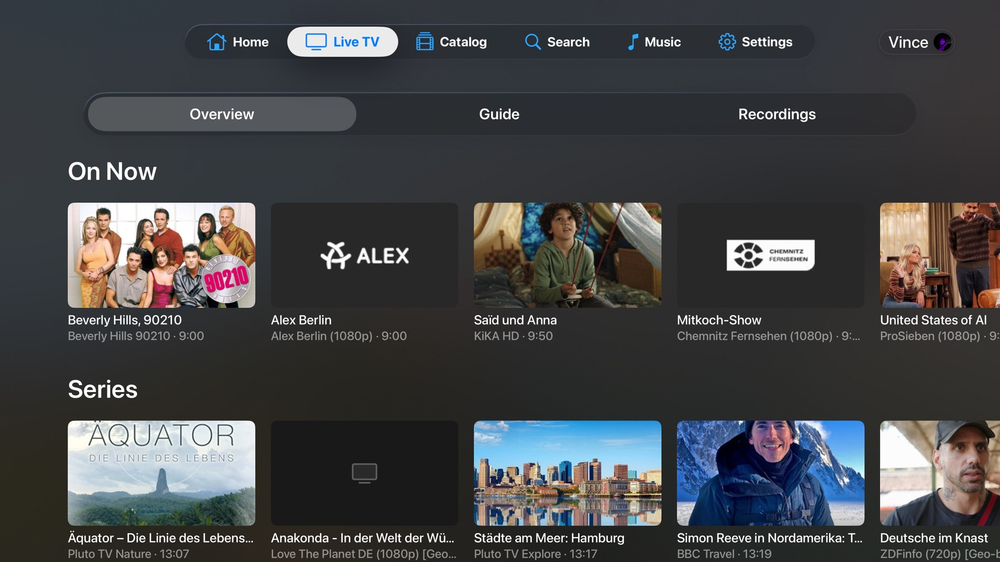
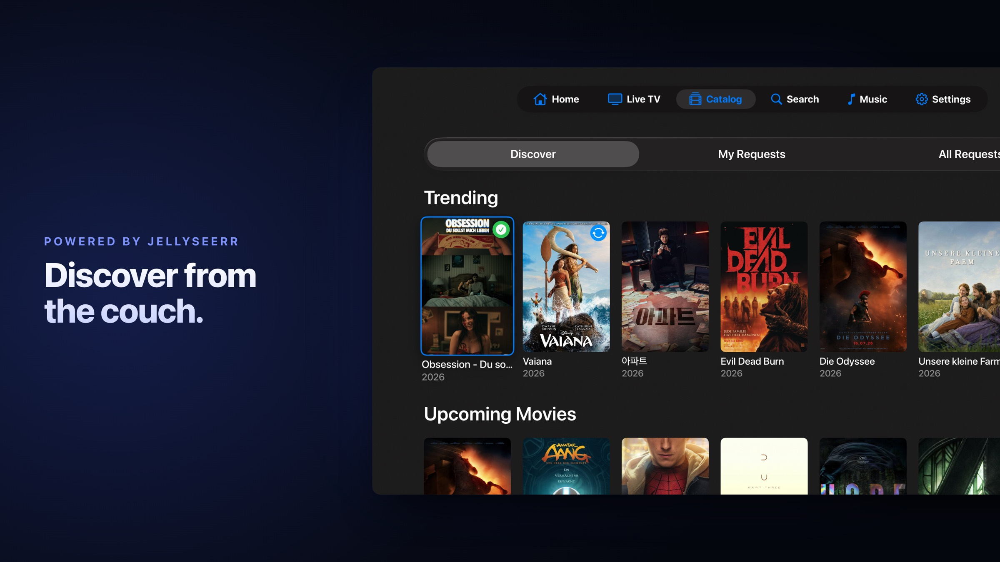
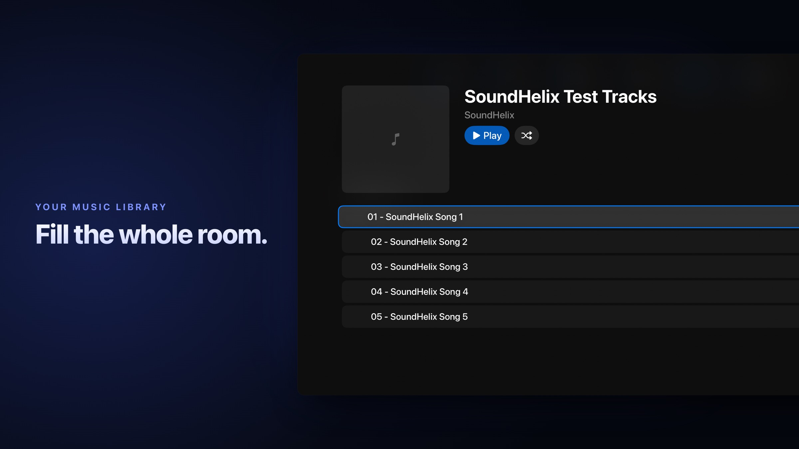
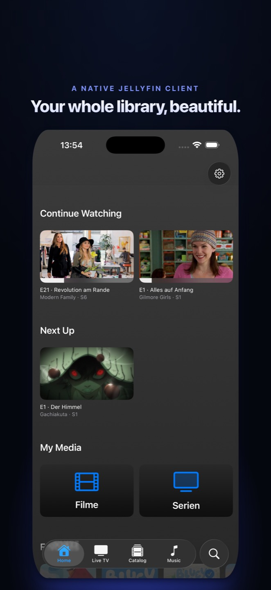

<p align="center">
  
</p>

<h1 align="center">Sodalite</h1>

<p align="center">
  <b>Your Jellyfin library <i>and</i> Seerr, together on every Apple screen.</b><br>
  Native for Apple TV, iPhone and iPad. Instant playback, real HDR, real Dolby Atmos.<br>
  Browse what you own. Request what's missing. Tune into live TV.<br>
  On the couch, in your hand, wherever you are.
</p>

<p align="center">
  
  
  
  
  
  
  <a href="https://ko-fi.com/superuser404"></a>
</p>

> 🧪 **Public Beta is open.** One TestFlight link installs on **Apple TV, iPhone and iPad**: **https://testflight.apple.com/join/nWeQzmBX**
> See [BETA.md](BETA.md) for what to focus on and how to report bugs.

---

## One app, every Apple screen

Sodalite is a **single universal app**. The same library, the same Seerr request loop, the same custom video stack, whether you're on the Apple TV in the living room, an iPhone on the train, or an iPad in bed. Sign in once per server; the whole experience follows the device you pick up.

It brings **Jellyfin and Seerr together in the same UI**. Watch what's already on your server. Spot something on a trending row that isn't there yet? Request it from inside the app, and Seerr handles the rest. No switching to a phone browser, no pinging your homelab admin, no leaving the app you're already in.

## Screenshots

<table>
  <tr>
    <td width="50%"><a href=".github/media/screenshot-home.jpg"></a></td>
    <td width="50%"><a href=".github/media/screenshot-tv.jpg"></a></td>
  </tr>
  <tr>
    <td align="center"><b>Home</b> (Apple TV)</td>
    <td align="center"><b>Live TV</b> (Apple TV)</td>
  </tr>
  <tr>
    <td width="50%"><a href=".github/media/screenshot-catalog.jpg"></a></td>
    <td width="50%"><a href=".github/media/screenshot-music.jpg"></a></td>
  </tr>
  <tr>
    <td align="center"><b>Catalog</b> (Apple TV)</td>
    <td align="center"><b>Music</b> (Apple TV)</td>
  </tr>
</table>

<!--
  iPhone & iPad screenshots: drop four files into .github/media/, then uncomment this block.
  Suggested shots: iPhone Home portrait, iPhone player in landscape (with format badge),
  iPad Library grid, iPad detail page.

<table>
  <tr>
    <td width="25%"><a href=".github/media/ios-home.jpg"></a></td>
    <td width="25%"><a href=".github/media/ios-player.jpg"></a></td>
    <td width="50%"><a href=".github/media/ipad-library.jpg"></a></td>
  </tr>
  <tr>
    <td align="center"><b>Home</b> (iPhone)</td>
    <td align="center"><b>Player</b> (iPhone)</td>
    <td align="center"><b>Library</b> (iPad)</td>
  </tr>
</table>
-->

## What runs where

Almost everything is identical across devices, it's one codebase. A handful of capabilities are platform-native by design:

| Capability | Apple TV | iPhone &amp; iPad |
|---|:---:|:---:|
| Full library, Direct Play, HDR, Dolby Atmos, all subtitle formats | ✓ | ✓ |
| Seerr browse &amp; request, single sign-on | ✓ | ✓ |
| Live TV &amp; DVR | ✓ | ✓ |
| Music library | ✓ | ✓ |
| Watch Stats, parental controls, 26 languages | ✓ | ✓ |
| Picture in Picture | – | ✓ |
| AirPlay to another display | – | ✓ |
| Full-screen video out over a wired HDMI adapter | – | ✓ |
| Rotation lock &amp; portrait player | – | ✓ |
| Top Shelf &amp; Siri Remote focus UX | ✓ | – |

## Open source, end to end

Sodalite is open from end to end. Every byte that touches your server is in this repo, your auth tokens stay in your Keychain, and there's no telemetry, no analytics, no third-party SDK phoning home.

Licensed under **GPL-3.0 with an Apple Store / DRM Exception**. Fork it, study it, build your own version, but no one can take it private. Modifications must stay open. The exception clause in the LICENSE keeps the App Store and TestFlight distribution paths legally clean. The video stack underneath ([AetherEngine](https://github.com/superuser404notfound/AetherEngine)) is **LGPL-3.0** with the same Apple Store exception, so the engine can be reused in other apps while engine-level improvements flow back to the community. Both are auditable, buildable from source, and free of any vendor lock-in. Self-host the server, self-build the client, the whole loop is yours.

## Built natively for Apple platforms

Sodalite is built natively from the ground up: SwiftUI on top, a custom video engine underneath, and the same HIG patterns Apple uses across its own apps, focus engine and Siri Remote gestures on tvOS, touch and rotation on iPhone and iPad. It plays the file directly from your server in almost every case, no transcoding required, and live channels stream straight from their source where possible.

The Seerr integration isn't a tacked-on link to a web view. It's a first-class part of the app, with its own browse rows, request flow, and status tracking right next to your library.

## Features

### 📚 Browse & discover
- **Server discovery**: finds Jellyfin on your network automatically, or add manually
- **Multiple servers**: keep several Jellyfin servers in the app and switch between them without logging out; pick or add one from above your profile list, manage the full list in Settings → Servers
- **Home**: Continue Watching, Next Up, a separate Latest row for each of your libraries, plus a My Media row to jump straight into any library; every row can be toggled and reordered, and Continue Watching and Next Up can optionally merge into a single row
- **Library**: Movies, Series, Collections with poster grids, instant filtering and an All / Unwatched / Watched watch-status filter on every grid
- **Series view**: season picker, episode list, "Up Next" highlighting
- **Playlists**: your Jellyfin playlists get their own Home row and a detail page that plays through in order
- **Search**: across your whole server, results as you type
- **Image caching & prefetching**: posters and backdrops load before you reach them
- **Delete from the app**: remove movies, series, or individual seasons from your library, with optional cleanup of matching Radarr / Sonarr entries when Jellyseerr is connected
- **Rich detail pages**: cast, ratings, where-to-watch and more-like-this on catalog titles; tagline, director, writer and studios on your own library
- **Title logos & synopses**: detail screens float the title logo over the backdrop and show full episode synopses, both toggleable in Appearance settings
- **Full-bleed backdrops**: artwork shines through the whole detail page and dims as you scroll; titles without backdrop art get an ambient poster fill instead of a grey plate
- **Watched tracking**: mark movies, episodes, seasons or whole series as watched or unwatched, with progress badges across Home and detail screens
- **Cast & filmography**: open any cast member to see their photo, biography and full filmography, then jump straight to a title in your library or request it from the catalog

### 🎬 Watch
- **Direct Play** for almost every codec on your server: H.264, HEVC, HEVC Main10, AV1, VP9, VP8, MPEG-4 Part 2 (XVID / DIVX), MPEG-2, VC-1. Containers: MKV, MP4, MOV, AVI, MPEG-TS, M2TS, VOB, 3GP, WebM, OGG, FLV. Server-side transcoding stays reserved for fringe codecs (WMV3, Theora, RealVideo).
- **HDR10, HDR10+, Dolby Vision, HLG**: auto-detected, sent through with full color metadata. HDR10+ streams forward per-frame ST 2094-40 dynamic metadata so HDR10+ displays apply the source's tone-mapping curves; Dolby Vision streams switch DV-capable Apple TVs into Dolby Vision mode for Profile 5, 8.1 and 8.4 (Profile 7 is converted to single-layer 8.1 on device so it engages DV too): Profile 5 signals via a bare `dvh1` track tag, while 8.1 and 8.4 carry `dvh1` in `SUPPLEMENTAL-CODECS` on an `hvc1` base. On Apple TV the display switches to the matching HDR mode automatically (Match Content); on iPhone and iPad the built-in HDR display renders it directly.
- **Dolby Atmos** via EAC3+JOC, wrapped as Dolby MAT 2.0 so an AVR's Atmos light actually comes on over an Apple TV; on iPhone and iPad it plays through spatialized audio where the device supports it
- **Multichannel surround**: 5.1, 7.1 with correct channel layout
- **Resume** from where you left off, on any device
- **Restart from the beginning**: a dedicated button on movies, series and episodes to play from the start instead of resuming
- **Pick your source**: when a title has more than one version on your server (different rips, resolutions or editions), a picker lets you choose which one to play before playback starts, on both movies and episodes
- **Shuffle a series**: a shuffle button on series detail queues random episodes across every season
- **Trailers**: play a title's local trailer straight from your server with a dedicated button on the detail page
- **Intro skip**: auto-detected from your Jellyfin server, optional one-tap skip
- **Next episode**: auto-play with countdown, or just an overlay; configurable
- **Subtitles, all formats, client-side**: text codecs (SubRip, ASS, SSA, WebVTT, mov_text) decoded inline in AetherEngine as packets flow through the demuxer, no server extraction lag on first hit. Bitmap subtitles (PGS, HDMV PGS, DVB, DVD) rendered as native images at the right position on the frame, no more relying on the server having Tesseract installed for Blu-ray rips. Sidecar `.srt` / `.ass` / `.vtt` files parsed by FFmpeg as well. In-band CEA-608 closed captions (the `eia_608` caption track some streams and rips carry) are decoded on-device too and appear in the subtitle menu like any other track. Styled ASS / SSA rendering keeps the original fonts, colors and positioning, for both embedded and external sidecar tracks (toggle between styled and plain text in Playback settings). Track switching mid-playback, with auto-resolution against your preferred audio / subtitle language.
- **Subtitle search & download**: when your server is missing the right track, search and download subtitles from inside the player. Files that match by content hash get a badge so you know they line up, and ones you added can be removed with a long press.
- **Dual subtitles**: show a second simultaneous subtitle track above the first, for example the original language plus a translation. Pick a secondary track from the Secondary section at the top of the subtitle menu (text tracks only).
- **Audio track switcher**: pick the language or surround mix you want, mid-playback
- **Scrub preview**: thumbnails of the exact frame as you scrub, floating above the playhead, generated on-device by AetherEngine straight from the video so they land on the precise frame and work even when your server has no trickplay images prepared. An optional setting lets you prefer your server's pre-generated trickplay images instead (decode-free, lighter on older devices), falling back to on-device when the server has none
- **Custom player UI**: a hand-built transport bar and info panel on top of our own video engine, matching the gestures and feel of Apple's own player without using the system player
- **Now Playing skip**: the 10-second forward and backward buttons in the system Now Playing controls (Control Center on iPhone and iPad, the Now Playing panel on Apple TV) route through to the engine via `MPRemoteCommandCenter`, App Store compliant, no private API
- **Stats for Nerds overlay**: optional info panel during playback. Static section shows container, video codec / range / framerate / bitrate / decoder, audio codec / channels / bitrate / decoder, subtitle codec. Live section refreshes at 1 Hz with instant + average bitrate from the demuxer, forward buffer + cached MB, network throughput, dropped frames (native AVPlayer) or observed FPS (software AV1), plus a colour-coded A/V sync gap. A second toggle adds an Engine Diagnostics deep-dive (producer restarts, RSS, demuxer / muxer / audio-bridge bytes, server traffic) for troubleshooting. Enable in Settings → Playback → Advanced.

### 📱 On iPhone & iPad
- **Picture in Picture**: shrink playback into a floating window and keep browsing, or leave the app entirely; text subtitles render inside the PiP window and survive seeking in both directions
- **AirPlay**: send any title to an AirPlay display, with HDR and surround metadata preserved
- **Wired HDMI out**: plug in a USB-C to HDMI adapter and playback fills the connected screen instead of showing the mirrored phone window
- **Rotation lock**: a one-tap toggle in the player pins landscape (or lets it follow the device), with a lock indicator so you always know which mode you're in
- **Format badge**: the top bar surfaces the live format (Dolby Vision, HDR10+, Atmos and friends) so you can confirm at a glance what's actually playing
- **Portrait-safe chrome**: player controls stay correctly placed in portrait and landscape, no clipped buttons behind the notch or home indicator
- **Touch-native throughout**: swipe to scrub, tap to play/pause, drag the grids, the whole app is built for touch as a first-class input, not a ported remote UI

### 📺 Live TV & DVR
- **Overview tab**: Live TV opens on a category-based overview of what's on right now, with rows mirroring the native Jellyfin guide, before you drop into the full grid
- **Programme guide**: full EPG grid with a sticky channel column, wall-clock time ruler, live now-line and current-program highlighting; open a program for info, watch and record actions
- **Channel favorites**: star channels in the guide, favorites sort to the top
- **Timeshift**: pause live TV, scrub back up to 10 minutes with on-device frame previews, snap back with Return to Live
- **Recordings & timers**: record a program or a whole series from the guide, manage scheduled timers, and play finished or still-recording shows
- **Direct from the source**: most channels play straight from their upstream, starting in seconds with no server transcoding, with automatic fallback through Jellyfin when a source needs it
- **Same engine as movies**: H.264 / HEVC channels ride the native pipeline, MPEG-2 / VC-1 and friends decode in software, and dead sources fail fast with a clear message instead of an endless spinner

### 🎵 Listen
- **Music library**: browse your Jellyfin music by album and play it back through the same engine, with a native Now Playing screen, cover art, scrubbing and background playback

### 📨 Request what's missing
- **Seerr integration**: browse trending and popular media right inside the app
- **One-tap requests** for movies and full series
- **Track status**: see what's been approved, declined, or is already downloading
- **Honest availability**: cross-checks your Jellyfin library so a title (or single season) deleted in Radarr / Sonarr shows as gone, not a stale "available", and stays re-requestable
- **Single sign-on**: log in once, Sodalite handles your Seerr session
- **Admin view**: with Jellyseerr admin permissions, approve, decline, edit, or delete any user's request right from the All Requests tab

### 🌍 Personal
- **Parental controls**: set a Guardian PIN to protect profiles and lock changes to settings, servers and profiles; a locked device returns to the profile picker on a cold start and gated actions ask for the PIN first, with recovery via your Jellyfin password
- **Watch Stats**: a Settings screen with your viewing totals, movies and episodes watched, completion rate, estimated hours, top genres, most-rewatched and recently-watched titles, all aggregated client-side from standard Jellyfin data
- **26 languages**: German, English, Spanish, French, Italian, Japanese, Korean, Norwegian, Dutch, Polish, Portuguese (BR + PT), Russian, Swedish, Simplified + Traditional Chinese, Turkish, Ukrainian, Czech, Slovak, Croatian, Finnish, Greek, Hungarian, Romanian, Danish
- **Dark, minimal design** that puts the artwork first, on the big screen and in your hand
- **Appearance options**: choose how Continue Watching and Now Playing artwork looks (episode still, backdrop or series thumb), set card size, toggle title logos, plus an accent color with the Supporter Pack
- **Liquid Glass** UI accents on tvOS 26 and iOS 26
- **Input-native everywhere**: Siri Remote touch scrubbing, click for play/pause and swipe gestures on Apple TV; touch scrubbing and gestures on iPhone and iPad

## Built on

Sodalite is a thin native shell over a custom video stack: Apple's frameworks plus a Swift package that handles the formats Apple's own player can't on its own. The same stack runs on tvOS, iOS and iPadOS.

| Component | Technology |
|---|---|
| UI | SwiftUI + UIKit interop where needed, one universal target for Apple TV, iPhone and iPad |
| Video engine | [AetherEngine](https://github.com/superuser404notfound/AetherEngine): FFmpeg demux, AVPlayer + VideoToolbox for HEVC / H.264 / HW-AV1, dav1d + libavcodec for AV1 / VP9 / VP8 / MPEG-4 Part 2 / MPEG-2 / VC-1 software fallback; live TV ingested directly from HLS upstreams with engine-side DVR |
| Display | `AVPlayer` + `AVPlayerLayer` for the native path; `AVSampleBufferDisplayLayer` + `AVSampleBufferRenderSynchronizer` for the software path |
| Audio | `AVPlayer` over local HLS-fMP4 for the native path (Atmos as MAT 2.0, EAC3 5.1 bridge by default for Opus / TrueHD / MLP / DTS / DTS-HD MA / MP2 / MP3 so surround works on every modern soundbar via the bitstream tunnel; optional lossless FLAC bridge for AVRs that accept multichannel LPCM over HDMI); `AVSampleBufferAudioRenderer` for the software path |
| Networking | `URLSession` against the Jellyfin REST API |
| Persistence | Keychain for credentials, no telemetry storage |
| Media server | [Jellyfin](https://jellyfin.org) |

For the full pipeline detail (HDR routing, Atmos passthrough, A/V sync, channel-layout tagging), see the [AetherEngine README](https://github.com/superuser404notfound/AetherEngine#readme).

## Requirements

| Device | Min |
| --- | --- |
| Apple TV | 4K (any generation), tvOS 26 |
| iPhone | iOS 26 |
| iPad | iPadOS 26 |
| Jellyfin server | 10.9+ recommended |
| Seerr (optional) | 2.0+ |

A 1080p Apple TV HD will technically run the app, but Direct Play of 4K HDR content needs the 4K hardware. On iPhone and iPad the built-in display renders HDR directly, no external panel required.

## Building from source

```bash
git clone https://github.com/superuser404notfound/Sodalite.git
cd Sodalite
open Sodalite.xcodeproj
```

Pick the `Sodalite` scheme, then an Apple TV, iPhone or iPad destination, and run. It's one universal target, the same scheme builds for all three. AetherEngine is referenced as a remote Swift Package pinned by commit SHA in `Package.resolved`, so Xcode resolves and fetches it from GitHub automatically. No local clone is required to build Sodalite.

If you also want to work on the engine, clone it next to this repo and switch the package reference to your local copy in Xcode:

```
~/Dev/
├── Sodalite/
└── AetherEngine/
```

Xcode 26+ and Swift 6.0+ are required.

For engine-level debugging without a device in the loop, AetherEngine ships a standalone macOS CLI (`aetherctl probe / serve / validate <url>`). See [AetherEngine's CLI docs](https://github.com/superuser404notfound/AetherEngine/blob/main/docs/cli.md) for usage.

## Roadmap

- [x] Public TestFlight beta
- [x] Music library
- [x] Live TV + DVR support
- [x] iPhone / iPad universal app
- [ ] App Store release
- [ ] In-app library-update banner via Jellyfin's WebSocket, surfaces a quiet notification when Sonarr / Radarr ingests new content while Sodalite is open. No backend service, no APNs, same self-hosted data flow as everything else

## Community

Everything happens in the open. No Discord, no closed garden.

- **[Discussions](https://github.com/superuser404notfound/Sodalite/discussions)**: Q&A, ideas, show-and-tell
- **[Issues](https://github.com/superuser404notfound/Sodalite/issues)**: bugs and concrete feature requests

If you're not sure which to use, start a Discussion. Bugs get moved to Issues. Both are public, indexed by search engines, and stay tied to the project, so the next person with the same question can find the answer.

## Support

Sodalite is free and stays that way. If it's useful to you and you'd like to say thanks, there's a [Ko-fi](https://ko-fi.com/superuser404). The app also has an in-app Tip Jar and a Supporter Pack (cosmetics only, no gating).

## Related

- [AetherEngine](https://github.com/superuser404notfound/AetherEngine): the video engine powering Sodalite
- [Jellyfin](https://github.com/jellyfin/jellyfin): the free software media system
- [Seerr](https://github.com/Fallenbagel/jellyseerr): request management for Jellyfin

## Built with

Sodalite is vibe-coded, designed and shipped by [Vincent Herbst](https://github.com/superuser404notfound) in close pair-programming with **Claude** (Anthropic). The commit log is the receipt: nearly every commit carries a `Co-Authored-By: Claude` trailer.

## License

[GPL-3.0 with Apple Store / DRM Exception](LICENSE). The exception clause keeps App Store and TestFlight distribution legally clean while the GPL keeps the source open and forks copyleft.
